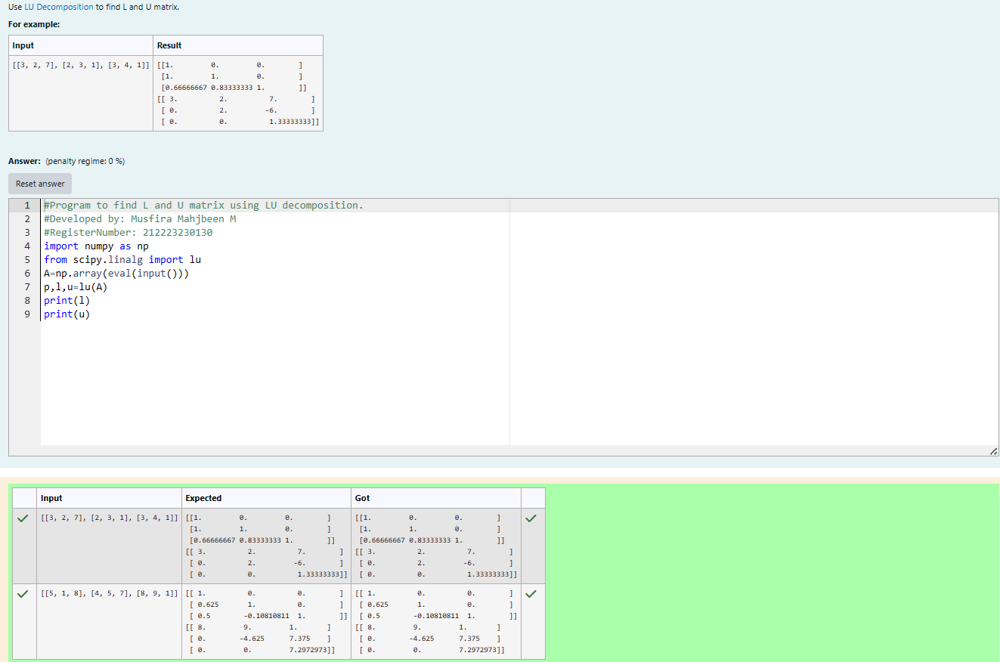
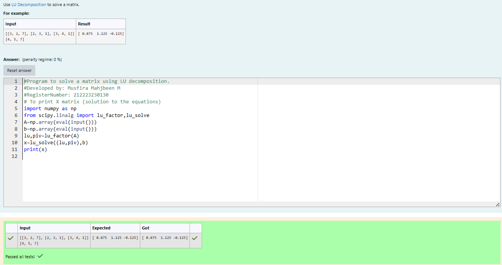

# LU Decomposition

## AIM:

To write a program to find the LU Decomposition of a matrix.

## Equipments Required:

1. Hardware – PCs
2. Anaconda – Python 3.7 Installation / Moodle-Code Runner

## Algorithm

1. import numpy library using import statement.
2. From scipy package import lu().
3. Get input from user and pass it as an array.
4. Get P, L U martix using lu().
5. print L and U matrix.

## Program:

(i) To find the L and U matrix

```python
# Program to find the L and U matrix.
# Developed by: MUSFIRA MAHJABEEN
# RegisterNumber: 212223230130
import numpy as np
from scipy.linalg import lu
A=np.array(eval(input()))
P,L,U=lu(A)
print(L)
print(U)
```

(ii) To find the LU Decomposition of a matrix

```PYTHON
# Program to find the LU Decomposition of a matrix.
# Developed by: MUSFIRA MAHJABEEN
# RegisterNumber: 212223230130
import numpy as np
from scipy.linalg import lu_factor, lu_solve
A=np.array(eval(input()))
b=np.array(eval(input()))
lu, piv = lu_factor(A)
x= lu_solve((lu,piv),b)
print(x)
```

## Output:

(i) To find the L and U matrix


(ii) To find the LU Decomposition of a matrix


## Result:

Thus the program to find the LU Decomposition of a matrix is written and verified using python programming.
